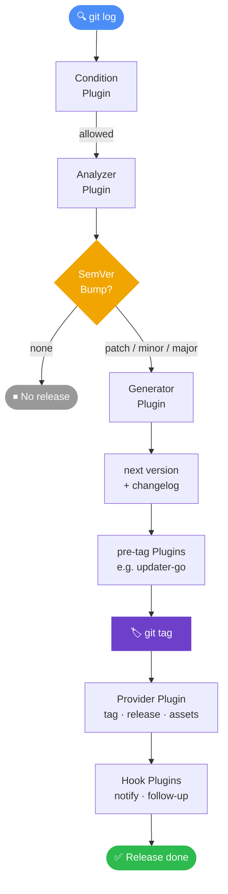

import { Card, CardGrid } from '@astrojs/starlight/components';

**semrel** automatisiert deine Release Pipeline, indem es [Conventional Commits](https://www.conventionalcommits.org/) auswertet, die korrekte nächste [SemVer](https://semver.org/)-Version berechnet, einen Changelog erzeugt und konfigurierbare Release Plugins ausführt.

## Warum semrel?

Manuelle Versionierung ist fehleranfällig und langsam. semrel nimmt dir das Rätselraten ab:

- Ein `feat:`-Commit erhöht die **minor**-Version.
- Ein `fix:`-Commit erhöht die **patch**-Version.
- Ein Commit mit `BREAKING CHANGE:` im Footer erhöht die **major**-Version.
- Alles ist über deine Git-Historie reproduzierbar und nachvollziehbar.

## Kernfunktionen

<CardGrid>
  <Card title="Automatisierte Versionierung" icon="approve-check">
    Analysiert Conventional Commits seit dem letzten Tag und bestimmt automatisch den korrekten SemVer-Bump.
  </Card>
  <Card title="Plugin-System" icon="puzzle">
    Jeder Schritt der Release Pipeline kann von einem eigenständigen Plugin-Executable übernommen werden, das von semrel gefunden und ausgeführt wird.
  </Card>
  <Card title="Monorepo-Unterstützung" icon="seti:folder">
    Versioniere mehrere unabhängige Module in einem Repository, jeweils mit eigener Tag-Historie.
  </Card>
  <Card title="Sprachunabhängig" icon="translate">
    Plugins sind einfache Executables. Du kannst sie deshalb in jeder Sprache schreiben und über Umgebungsvariablen sowie normale Prozessausführung integrieren.
  </Card>
</CardGrid>

## So funktioniert es

Jede Phase kann von einem separaten Plugin-Executable übernommen werden. Installiere offizielle Plugins mit Befehlen wie `semrel plugin install github` und konfiguriere sie anschließend in `.semrel.yaml`.

## Nächste Schritte

- [Installiere semrel](/getting-started/installation/)
- [Starte dein erstes Release in 5 Minuten](/getting-started/quick-start/)
- [Verstehe die Konfigurationsdatei](/guide/configuration/)
- [Durchsuche offizielle Plugins](/plugins/)
- [Entdecke die Plugin Registry](https://registry.semrel.io)