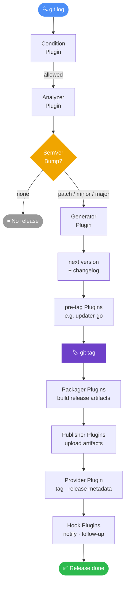

import { Card, CardGrid, Aside, LinkButton } from '@astrojs/starlight/components';

**semrel** automatisiert deine Release-Pipeline, indem es [Conventional Commits](https://www.conventionalcommits.org/) auswertet, die korrekte nächste [SemVer](https://semver.org/)-Version berechnet, einen Changelog erzeugt und konfigurierbare Release-Plugins ausführt — mit **null Laufzeitabhängigkeiten**.

<Aside type="tip" title="Von semantic-release migrieren?">
  semrel repliziert dieselbe Conventional-Commits → SemVer-Automatisierung ohne Node.js. Siehe den [Migrations-Guide und Vergleich →](/de/guide/comparison/)
</Aside>

## Warum semrel?

Manuelle Versionierung ist fehleranfällig und langsam. semrel nimmt dir das Rätselraten ab:

- Ein `feat:`-Commit erhöht die **minor**-Version.
- Ein `fix:`-Commit erhöht die **patch**-Version.
- Ein Commit mit `BREAKING CHANGE:` im Footer erhöht die **major**-Version.
- Alles ist über deine Git-Historie reproduzierbar und nachvollziehbar.

## Kernfunktionen

<CardGrid>
  <Card title="Automatisierte Versionierung" icon="approve-check">
    Analysiert Conventional Commits seit dem letzten Tag und bestimmt automatisch den korrekten SemVer-Bump.
  </Card>
  <Card title="Plugin-System" icon="puzzle">
    Jeder Schritt der Release Pipeline kann von einem eigenständigen Plugin-Executable übernommen werden, das von semrel gefunden und ausgeführt wird.
  </Card>
  <Card title="Monorepo-Unterstützung" icon="code-branch">
    Versioniere mehrere unabhängige Module in einem Repository, jeweils mit eigener Tag-Historie.
  </Card>
  <Card title="Sprachunabhängig" icon="translate">
    Plugins sind einfache Executables. Du kannst sie deshalb in jeder Sprache schreiben und über Umgebungsvariablen sowie normale Prozessausführung integrieren.
  </Card>
</CardGrid>

## So funktioniert es

Jede Phase kann von einem separaten Plugin-Executable übernommen werden. Installiere offizielle Plugins mit Befehlen wie `semrel plugin install @semrel/provider-github` und konfiguriere sie anschließend in `.semrel.yaml`.

## semrel vs. die Alternativen

| | semrel | semantic-release | goreleaser | release-please | release-it | changesets |
|---|---|---|---|---|---|---|
| Runtime | **Keine (statische Binärdatei)** | Node.js + npm | Keine (statische Binärdatei) | Node.js + npm | Node.js + npm | Node.js + npm |
| Auto-SemVer aus Commits | ✅ | ✅ | ❌ tag-basiert | ✅ | ✅ | ❌ manuell |
| Scope-basierte Bump-Regeln | **✅** | ✅ | ❌ | ❌ | ❌ | ❌ |
| Air-gap / Offline-CI | **✅ Nativ** | ❌ | ✅ | ❌ | ❌ | ❌ |
| Supply-Chain-Sicherheit | **Cosign + SBOM + SLSA** | ❌ | Cosign | ❌ | ❌ | ❌ |
| Plugin-Sprache | **Beliebige Binärdatei** | Nur JavaScript | Go (eingebaut) | Fest vorgegeben | Nur JavaScript | Nur JavaScript |
| Monorepo | **✅ Kostenlos** | ✅ Kostenlos | ✅ Kostenlos (OSS) | ✅ | ✅ | ✅ |

→ [Vollständiger Vergleich: semrel vs semantic-release vs goreleaser vs release-please vs release-it vs changesets](/de/guide/comparison/)

## Nächste Schritte

- [Installiere semrel](/de/getting-started/installation/)
- [Starte dein erstes Release in 5 Minuten](/de/getting-started/quick-start/)
- [Verstehe die Konfigurationsdatei](/de/guide/configuration/)
- [Durchsuche offizielle Plugins](/de/plugins/)
- [Entdecke die Plugin Registry](https://registry.semrel.io)