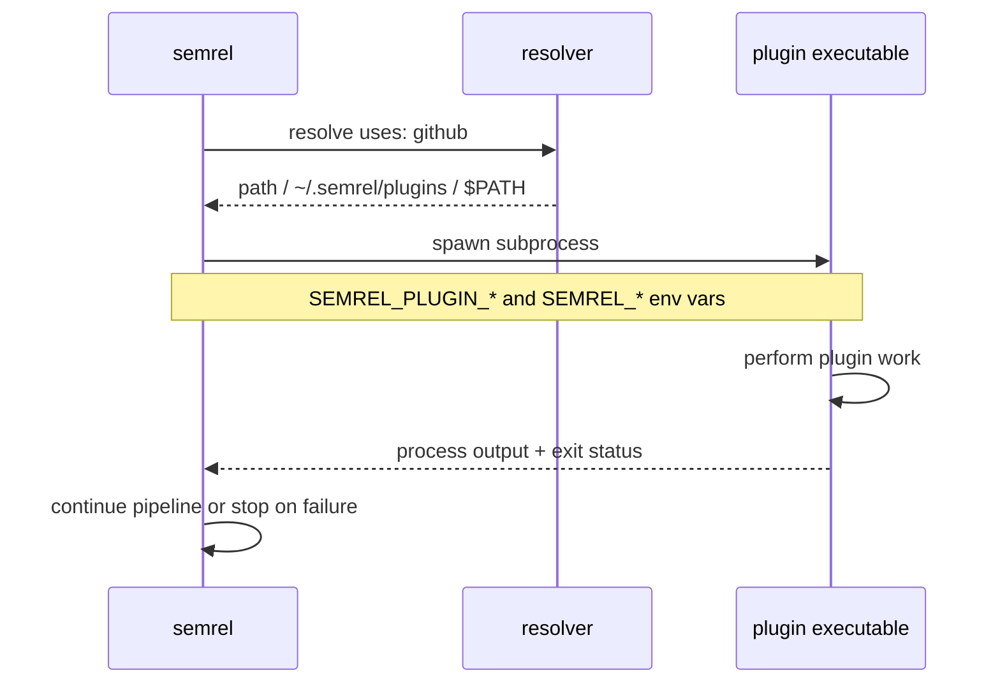

import { Card, CardGrid, Aside } from '@astrojs/starlight/components';

Die Release-Pipeline von semrel besteht aus eigenständigen Plugin-Binärdateien. Jedes Plugin wird lokal gefunden und als Subprozess ausgeführt – es gibt keine gRPC-Schicht und keinen RPC-Handshake.

## So funktionieren Plugins

1. semrel liest jeden Plugin-Eintrag aus `.semrel.yaml`.
2. Der Wert `uses:` wird normalerweise zu einer Binärdatei namens `semrel-plugin-<uses>` aufgelöst.
3. semrel sucht diese Binärdatei zuerst an einem expliziten `path:`, dann in `~/.semrel/plugins/`, dann in `$PATH`.
4. Plugin-`args:`-Werte werden als Umgebungsvariablen im Format `SEMREL_PLUGIN_<KEY>=<value>` bereitgestellt.
5. Der Release-Kontext wird ebenfalls über Umgebungsvariablen übergeben, sodass jedes Plugin dieselbe Version, Branch, Tag, denselben Changelog und denselben Dry-Run-Status lesen kann.
6. semrel führt die Binärdatei aus und verwendet das Prozessergebnis, um die Pipeline fortzusetzen oder zu stoppen.

## Release-Kontext-Umgebung

Diese Umgebungsvariablen stehen Plugin-Prozessen während der Ausführung zur Verfügung.

| Variable | Beschreibung |
| --- | --- |
| `SEMREL_VERSION` | Die semrel-CLI-Version |
| `SEMREL_TAG_NAME` | Vollständiger Tag-Name für die Release |
| `SEMREL_CURRENT_VERSION` | Aktuelle Projektversion |
| `SEMREL_NEXT_VERSION` | Nächste für die Release ausgewählte Version |
| `SEMREL_BUMP` | Berechnete Bump-Stufe |
| `SEMREL_BRANCH` | Aktuelle Git-Branch |
| `SEMREL_TAG_PREFIX` | Konfiguriertes Tag-Präfix |
| `SEMREL_CHANGELOG` | Erzeugter Changelog-Inhalt |
| `SEMREL_DRY_RUN` | Ob der aktuelle Lauf ein Dry-Run ist |

## Plugin-Typen

Der aktuelle offizielle Plugin-Katalog ist in sechs Kategorien organisiert.

<CardGrid>
  <Card title="Provider Plugin" icon="github">
    Kümmert sich um Forge- und Git-Operationen wie das Lesen der Release-Historie, das Erstellen von Tags und das Veröffentlichen von Releases.
  </Card>
  <Card title="Condition Plugin" icon="approve-check-circle">
    Prüft, ob die aktuelle Umgebung eine Release veröffentlichen darf.
  </Card>
  <Card title="Analyzer Plugin" icon="magnifier">
    Untersucht Commits und entscheidet über die SemVer-Bump-Stufe.
  </Card>
  <Card title="Generator Plugin">
    Erzeugt Changelogs, Release Notes und andere auf Releases bezogene Inhalte.
  </Card>
  <Card title="Updater Plugin" icon="pencil">
    Aktualisiert versionierte Projektdateien, bevor die Release abgeschlossen wird.
  </Card>
  <Card title="Hook Plugin" icon="warning">
    Sendet Benachrichtigungen oder führt nach Erfolg oder Fehler nachgelagerte Automatisierung aus.
  </Card>
</CardGrid>

## Plugin-Erkennung

Entdecke offizielle Plugins im [Plugin Registry](/plugins/registry/) oder installiere sie direkt mit `semrel plugin install <name>`.

semrel löst Plugins aus dem konfigurierten `uses:`-Wert auf:

```yaml
plugins:
  - uses: github
    name: github-release
    args:
      owner: MyOrg
      repo: my-repo

  - uses: slack-notify
    path: /usr/local/bin/semrel-plugin-slack
    args:
      webhook_url: ${{ env.SLACK_WEBHOOK }}
```

<Aside type="tip">
  `semrel plugin install github` lädt die Plugin-Binärdatei nach `~/.semrel/plugins/` herunter, wo zukünftige Läufe sie automatisch finden können.
</Aside>

## Plugin-Lebenszyklus



## Nächste Schritte

- [Official Plugins](/plugins/)
- [Plugin Registry](/plugins/registry/) — oder direkt auf [registry.semrel.io](https://registry.semrel.io) stöbern
- [Plugin Publishing Guide](/plugins/publishing/)
- [Plugin SDK — writing your first plugin](/plugins/sdk/)
