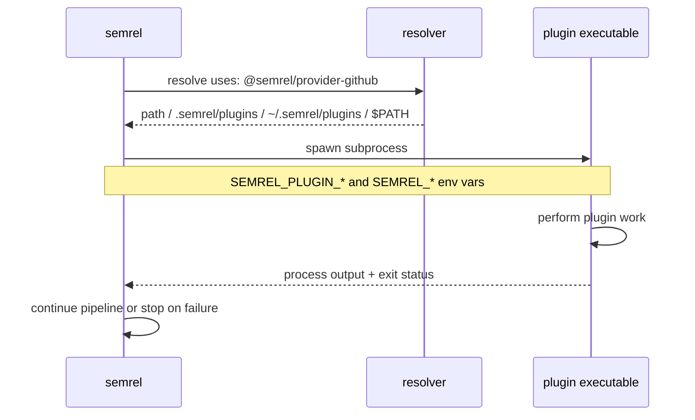

{/* This code has been partially generated by an AI. */}

import { Badge, Card, CardGrid, Aside, LinkButton } from '@astrojs/starlight/components';


<picture>
  <source srcset="/plugin-ecosystem.webp" type="image/webp" />
  
</picture>


Die Release-Pipeline von semrel besteht aus eigenständigen Plugin-Binärdateien. Jedes Plugin wird lokal gefunden und als Subprozess ausgeführt – es gibt keine gRPC-Schicht und keinen RPC-Handshake.

## So funktionieren Plugins

1. semrel liest jeden Plugin-Eintrag aus `.semrel.yaml`.
2. Der Wert `uses:` wird zu einer Binärdatei namens `semrel-plugin-<name>` aufgelöst, nachdem semrel Namespace, Version oder Kategorie-Präfix entfernt hat.
3. semrel sucht diese Binärdatei zuerst an einem expliziten `path:`, dann in `.semrel/plugins/`, dann in `~/.semrel/plugins/`, dann in `$PATH`.
4. Plugin-`args:`-Werte werden als Umgebungsvariablen im Format `SEMREL_PLUGIN_<KEY>=<value>` bereitgestellt.
5. Der Release-Kontext wird ebenfalls über Umgebungsvariablen übergeben, sodass jedes Plugin dieselbe Version, Branch, Tag, denselben Changelog und denselben Dry-Run-Status lesen kann.
6. semrel führt die Binärdatei aus und verwendet das Prozessergebnis, um die Pipeline fortzusetzen oder zu stoppen.

## Release-Kontext-Umgebung

Diese Umgebungsvariablen stehen Plugin-Prozessen während der Ausführung zur Verfügung.

| Variable | Beschreibung |
| --- | --- |
| `SEMREL_VERSION` | Aufgelöste Release-Version für den aktuellen Lauf |
| `SEMREL_TAG_NAME` | Vollständiger Tag-Name für die Release |
| `SEMREL_CURRENT_VERSION` | Aktuelle Projektversion |
| `SEMREL_NEXT_VERSION` | Nächste für die Release ausgewählte Version |
| `SEMREL_BUMP` | Berechnete Bump-Stufe |
| `SEMREL_BRANCH` | Aktuelle Git-Branch |
| `SEMREL_TAG_PREFIX` | Konfiguriertes Tag-Präfix |
| `SEMREL_CHANGELOG` | Erzeugter Changelog-Inhalt |
| `SEMREL_DRY_RUN` | Ob der aktuelle Lauf ein Dry-Run ist |

## Plugin-Typen

Der aktuelle offizielle Plugin-Katalog ist in acht Kategorien organisiert.

<CardGrid>
  <Card title="Provider Plugin" icon="github">
    Kümmert sich um Forge- und Git-Operationen wie das Lesen der Release-Historie, das Erstellen von Tags und das Veröffentlichen von Releases.
  </Card>
  <Card title="Condition Plugin" icon="approve-check-circle">
    Prüft, ob die aktuelle Umgebung eine Release veröffentlichen darf.
  </Card>
  <Card title="Analyzer Plugin" icon="magnifier">
    Untersucht Commits und entscheidet über die SemVer-Bump-Stufe.
  </Card>
  <Card title="Generator Plugin" icon="document">
    Erzeugt Changelogs, Release Notes und andere auf Releases bezogene Inhalte.
  </Card>
  <Card title="Updater Plugin" icon="pencil">
    Aktualisiert versionierte Projektdateien, bevor die Release abgeschlossen wird.
  </Card>
  <Card title="Packager Plugin" icon="add-document">
    Erstellt distributierbare Artefakte wie Linux-Pakete aus vorbereiteten Release-Eingaben.
  </Card>
  <Card title="Publisher Plugin" icon="external">
    Veröffentlicht Release-Artefakte in OCI-Registries oder über generische HTTP-Endpunkte.
  </Card>
  <Card title="Hook Plugin" icon="warning">
    Sendet Benachrichtigungen oder führt nach Erfolg oder Fehler nachgelagerte Automatisierung aus.
  </Card>
</CardGrid>

## Was ist mit Go-Binaries, Docker/Podman-Images, Helm und ähnlichen Zielen?

Diese Ziele sind heute über ein geteiltes Modell abgedeckt: **Updater bereiten versionierte Projektmetadaten vor**, während Packaging und Publishing über dedizierte Plugins und CI-Jobs laufen.

| Ziel | Aktuelle Plugins | Was sie heute tun | Typischer nächster Schritt |
| --- | --- | --- | --- |
| Go-Binaries | `updater-go` | Aktualisiert Go-Versionsvariablen vor dem Release-Tagging. | Binaries in CI mit `go build` bauen und danach Artefakte paketieren/veröffentlichen. |
| Docker/Podman-Images | `updater-docker` | Aktualisiert Versionsargumente in Dockerfiles. | Images in CI mit Docker oder Podman bauen und anschließend veröffentlichen. |
| Helm-Charts | `updater-helm` | Aktualisiert `Chart.yaml`-Version und optional `appVersion`. | Charts in CI oder OCI-kompatiblen Registries paketieren und veröffentlichen. |
| Linux-Pakete | `packager-nfpm` | Baut `deb`-, `rpm`- und `apk`-Pakete über `nfpm`. | Erzeugte Pakete in deine Paketkanäle veröffentlichen. |
| Generische/OCI-Artefakte | `publisher-generic-http`, `publisher-oci` | Lädt Release-Artefakte zu HTTP-Endpunkten oder OCI-Registries hoch. | Publisher nach Build-/Package-Stufen in die Pipeline einhängen. |

<Aside type="tip">
  Podman passt natürlich in dieses Modell: semrel orchestriert Release-Metadaten und Plugin-Ausführung, während eure CI frei entscheidet, ob Docker oder Podman für den Image-Build genutzt wird.
</Aside>

<Aside type="note">
  Du willst bestehende Updater-only-Pipelines migrieren? Nutze die [Plugin-Migrationsanleitung](/de/plugins/migration/) mit konkreten Schritt-für-Schritt-Pfaden.
</Aside>

## Plugin-Erkennung

Entdecke offizielle Plugins im [Plugin Registry](/de/plugins/registry/), installiere sie mit `semrel plugin install <ref>` und nutze die Anleitung [Plugins verwalten](/de/plugins/managing/) für Lock-Dateien und Restore-Workflows.

semrel löst Plugins aus dem konfigurierten `uses:`-Wert auf:

```yaml
plugins:
  - uses: @semrel/provider-github
    name: github-release
    args:
      owner: MyOrg
      repo: my-repo

  - uses: slack-notify
    path: /usr/local/bin/semrel-plugin-slack
    args:
      webhook_url: ${{ env.SLACK_WEBHOOK }}
```

<Aside type="tip">
  `semrel plugin install @semrel/provider-github` installiert das Plugin nach `.semrel/plugins/` und aktualisiert `.semrel.lock`. Legacy-Aliase wie `github` sind nur Kompatibilitätseingaben; verwende in neuen Konfigurationen den typisierten, gescopten Namen.
</Aside>

## Plugin-Lebenszyklus



## Nächste Schritte

<LinkButton href="/de/plugins/" icon="list-format">Offizielle Plugins</LinkButton>
<LinkButton href="/de/plugins/managing/" variant="secondary" icon="rocket">Plugins verwalten</LinkButton>
<LinkButton href="/de/plugins/registry/" variant="secondary" icon="magnifier">Plugin-Registry</LinkButton>
<LinkButton href="/de/plugins/migration/" variant="secondary" icon="open-book">Migrationsanleitung</LinkButton>
<LinkButton href="/de/plugins/sdk/" variant="minimal" icon="pencil">Plugin entwickeln</LinkButton>
