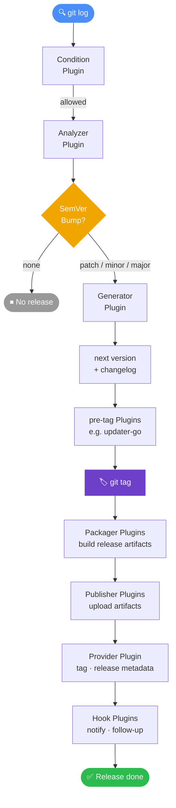

import { Card, CardGrid, Aside, LinkButton } from '@astrojs/starlight/components';

**semrel** automates your release pipeline by reading [Conventional Commits](https://www.conventionalcommits.org/), calculating the correct next [SemVer](https://semver.org/) version, generating a changelog, and running configurable release plugins — with **zero runtime dependencies**.

<Aside type="tip" title="Coming from semantic-release?">
  semrel replicates the same Conventional Commits → SemVer automation without requiring Node.js. See the [migration guide and comparison →](/guide/comparison/)
</Aside>

## Why semrel?

Manual versioning is error-prone and slow. semrel removes the guesswork:

- A `feat:` commit bumps the **minor** version.
- A `fix:` commit bumps the **patch** version.
- A commit with `BREAKING CHANGE:` in the footer bumps the **major** version.
- Everything is reproducible and auditable through your git history.

## Core Features

<CardGrid>
  <Card title="Automated Versioning" icon="approve-check">
    Analyses Conventional Commits since the last tag and determines the correct SemVer bump automatically.
  </Card>
  <Card title="Plugin System" icon="puzzle">
    Every step of the release pipeline can be handled by a standalone plugin executable discovered and run by semrel.
  </Card>
  <Card title="Monorepo Support" icon="code-branch">
    Version multiple independent modules inside one repository, each with its own tag history.
  </Card>
  <Card title="Language Agnostic" icon="translate">
    Plugins are plain executables, so they can be written in any language and integrated through environment variables and normal process execution.
  </Card>
</CardGrid>

## How it works

Each stage can be handled by a separate plugin executable. Install official plugins with commands such as `semrel plugin install github`, then configure them in `.semrel.yaml`.

## semrel vs the alternatives

| | semrel | semantic-release | goreleaser | release-please | release-it | changesets |
|---|---|---|---|---|---|---|
| Runtime | **None (static binary)** | Node.js + npm | None (static binary) | Node.js + npm | Node.js + npm | Node.js + npm |
| Semantic versioning from commits | ✅ | ✅ | ❌ (tag-based) | ✅ | ✅ | ❌ (manual) |
| Scope-based bump rules | **✅** | ✅ | ❌ | ❌ | ❌ | ❌ |
| Air-gap / offline CI | **✅ Native** | ❌ | ✅ | ❌ | ❌ | ❌ |
| Supply-chain security | **Cosign + SBOM + SLSA** | ❌ | Cosign | ❌ | ❌ | ❌ |
| Plugin language | **Any binary** | JavaScript | Go (built-in) | Hardcoded | JavaScript | JavaScript |
| Monorepo | **✅ Free** | ✅ Free | ✅ Free (OSS) | ✅ | ✅ | ✅ |

→ [Full comparison: semrel vs semantic-release vs goreleaser vs release-please vs release-it vs changesets](/guide/comparison/)

## Next steps

- [Install semrel](/getting-started/installation/)
- [Run your first release in 5 minutes](/getting-started/quick-start/)
- [Understand the configuration file](/guide/configuration/)
- [Browse official plugins](/plugins/)
- [Explore the Plugin Registry](https://registry.semrel.io)