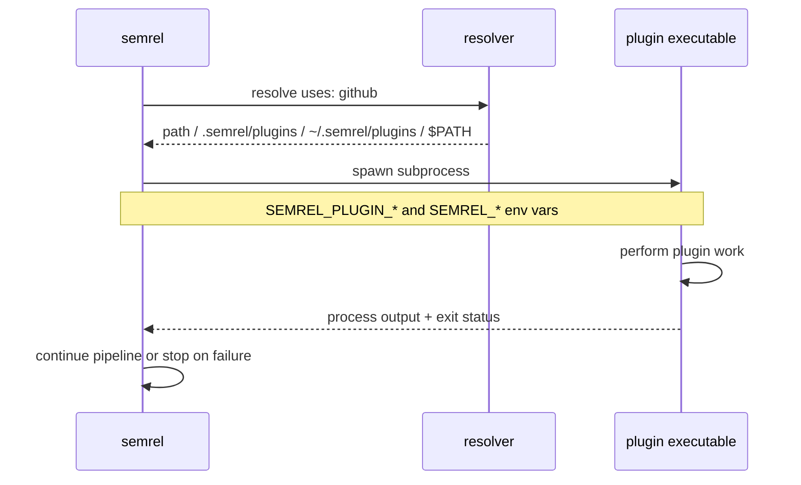

import { Badge, Card, CardGrid, Aside, LinkButton } from '@astrojs/starlight/components';


<picture>
  <source srcset="/plugin-ecosystem.webp" type="image/webp" />
  
</picture>


semrel's release pipeline is composed of standalone plugin executables. Each plugin is discovered locally and executed as a subprocess — there is no gRPC layer or RPC handshake.

## How plugins work

1. semrel reads each plugin entry from `.semrel.yaml`.
2. The `uses:` value resolves to a binary named `semrel-plugin-<name>` after semrel strips any namespace, version, or category prefix.
3. semrel looks for that binary at an explicit `path:`, then in `.semrel/plugins/`, then in `~/.semrel/plugins/`, then in `$PATH`.
4. Plugin `args:` values are exposed as environment variables in the form `SEMREL_PLUGIN_<KEY>=<value>`.
5. Release context is also passed through environment variables so every plugin can read the same version, branch, tag, changelog, and dry-run state.
6. semrel runs the executable and uses the process result to continue or stop the pipeline.

## Release context environment

These environment variables are available to plugin processes during execution.

| Variable | Description |
| --- | --- |
| `SEMREL_VERSION` | Resolved release version for the current run |
| `SEMREL_TAG_NAME` | Full tag name for the release |
| `SEMREL_CURRENT_VERSION` | Current project version |
| `SEMREL_NEXT_VERSION` | Next version selected for the release |
| `SEMREL_BUMP` | Calculated bump level |
| `SEMREL_BRANCH` | Current git branch |
| `SEMREL_TAG_PREFIX` | Configured tag prefix |
| `SEMREL_CHANGELOG` | Generated changelog content |
| `SEMREL_DRY_RUN` | Whether the current run is a dry run |

## Plugin types

The current official plugin catalog is organized into eight categories.

<CardGrid>
  <Card title="Provider Plugin" icon="github">
    Handles forge and git operations such as reading release history, creating tags, and publishing releases.
  </Card>
  <Card title="Condition Plugin" icon="approve-check-circle">
    Verifies that the current environment is allowed to publish a release.
  </Card>
  <Card title="Analyzer Plugin" icon="magnifier">
    Inspects commits and decides the SemVer bump level.
  </Card>
  <Card title="Generator Plugin" icon="document">
    Produces changelogs, release notes, and other release-facing content.
  </Card>
  <Card title="Updater Plugin" icon="pencil">
    Updates versioned project files before the release is finalized.
  </Card>
  <Card title="Packager Plugin" icon="package">
    Builds distributable artifacts such as Linux packages from prepared release inputs.
  </Card>
  <Card title="Publisher Plugin" icon="upload">
    Publishes release artifacts to OCI registries and generic HTTP endpoints.
  </Card>
  <Card title="Hook Plugin" icon="warning">
    Sends notifications or runs follow-up automation after success or failure.
  </Card>
</CardGrid>

## What about Go binaries, Docker/Podman images, Helm, and similar targets?

These targets are supported today with a split model: **updaters prepare versioned project metadata**, while packaging and publishing can run through dedicated plugins and CI jobs.

| Target | Current plugins | What they do today | Typical next step |
| --- | --- | --- | --- |
| Go binaries | `updater-go` | Updates Go version variables before release tagging. | Build binaries in CI with `go build` and then package/publish artifacts. |
| Docker/Podman images | `updater-docker` | Updates Dockerfile version arguments. | Build images in CI with Docker or Podman, then publish image artifacts. |
| Helm charts | `updater-helm` | Updates `Chart.yaml` version and optional `appVersion`. | Package and publish charts in CI or OCI-compatible registries. |
| Linux packages | `packager-nfpm` | Builds `deb`, `rpm`, and `apk` packages via `nfpm`. | Publish generated packages to your package channels. |
| Generic/OCI artifacts | `publisher-generic-http`, `publisher-oci` | Uploads release artifacts to HTTP endpoints or OCI registries. | Chain publishers after build/package stages. |

<Aside type="tip">
  Podman fits this workflow naturally: semrel orchestrates release metadata and plugin execution, while your CI decides whether to use Docker or Podman for container image builds.
</Aside>

## Plugin discovery

Discover official plugins in the [Plugin Registry](/plugins/registry/), install them with `semrel plugin install <ref>`, and use the [Managing Plugins](/plugins/managing/) guide for lock files and restore workflows.

semrel resolves plugins from the configured `uses:` value:

```yaml
plugins:
  - uses: github
    name: github-release
    args:
      owner: MyOrg
      repo: my-repo

  - uses: slack-notify
    path: /usr/local/bin/semrel-plugin-slack
    args:
      webhook_url: ${{ env.SLACK_WEBHOOK }}
```

<Aside type="tip">
  `semrel plugin install @semrel/github` installs the plugin into `.semrel/plugins/` and updates `.semrel.lock`. Bare names such as `github` only work when the registry entry has no namespace.
</Aside>

## Plugin lifecycle



## Next steps

<LinkButton href="/plugins/" icon="list-format">Official Plugins</LinkButton>
<LinkButton href="/plugins/managing/" variant="secondary" icon="rocket">Managing Plugins</LinkButton>
<LinkButton href="/plugins/registry/" variant="secondary" icon="magnifier">Plugin Registry</LinkButton>
<LinkButton href="/plugins/sdk/" variant="minimal" icon="pencil">Write a Plugin</LinkButton>